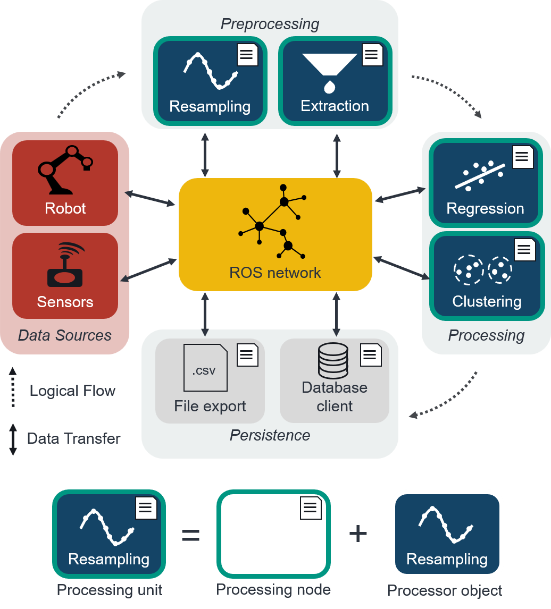

.. ros_ml_deploy documentation master file, created by
   sphinx-quickstart on Mon Apr 15 08:08:15 2024.
   You can adapt this file completely to your liking, but it should at least
   contain the root `toctree` directive.

Welcome to ROSMLDeploy's documentation!
=========================================

ROSMLDeploy enables versatile and scalable implementation of processing functionality in ROS contexts. 
It is aimed towards enabling deployment of machine learning models, but developers are free in the processes they want to implement.
Its target audience is developers already familiar with the core concepts of ROS who want to easily implement function pipelines. 
It includes automatic setup of ROS topics, publishers, and subscribers from config files for both processing and recording of data.

The above figure showcases how nodes enabled by ROSMLDeploy can be used to handle all processing tasks necessary.

.. toctree::
   :maxdepth: 2

   getting_started
   how_to_use
   code_docu

Indices and tables
==================

* :ref:`genindex`
* :ref:`modindex`
* :ref:`search`
