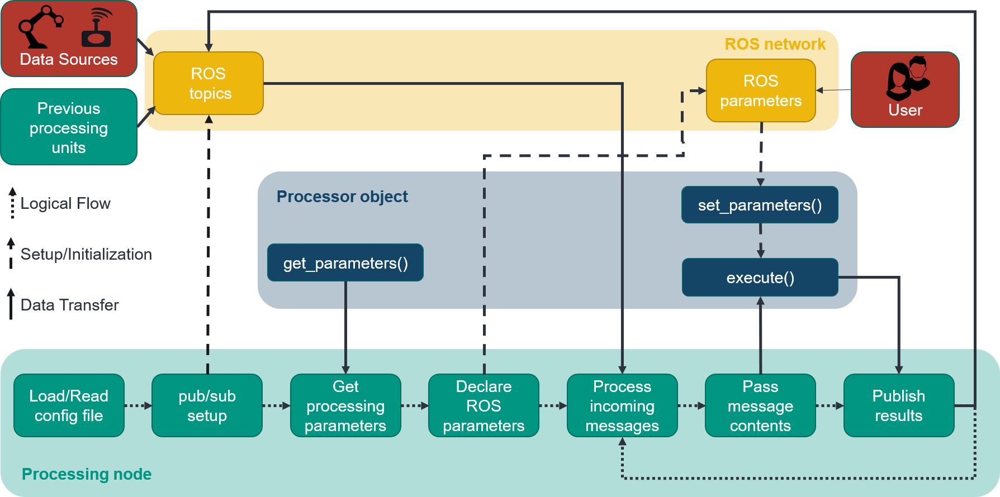

######################
How to use the package
######################

This page aims to show the intended use of the package and how to adapt it to specific use cases.
The following sections explain how to setup the processing and recording functionality, respectively.

----------
Processing
----------

Utilities needed for processing functionality are handled by the :class:`processing_node.processing_node.ProcessingNode`.
To set it up, the constructor expects a processor object aswell as a config path. In the config, the inputs and outputs of the processing node and their 
respective ROS topics are described. The processor object contains the main functionality of the node.

As a an example, the setup code of a simple processing node may look as follows:

.. literalinclude:: ./code_examples/adder.py
    :language: python
    :linenos:

with the respective config looking like:

.. literalinclude:: ./code_examples/adder_config.yaml
    :language: yaml
    :linenos:

~~~~~~
Config
~~~~~~

The provided config.yaml specifies what the inputs and outputs of the node are and on what topics they are being published on. For each Input, the respective ROS topic aswell
as the message type and exact message field need to be provided. Additionally, an optional description containing more detail is advised.
The same goes for each output of the node.

In the case of a layered message type, the Field might look like this: ["first_level/second_level/third_level/actual_data"]

Every message type specified in the config needs to be added to the Imports section aswell. For this, the package and module names need to be provided so the message
type can be imported at runtime.

~~~~~~~~~~~~~~~~
Processor object
~~~~~~~~~~~~~~~~

The provided processor object is expected to have a function called "execute". It takes as input a dict containing a list of each Input specified in the config and returns
a dict containig each Output specified in the config. 

The frequency with which this function is called can be provided as an optional parameter in the
constructor of the processing node.

The processing node also supports the use of parameters. For this, the additional functions "get_parameters", returning a dict of parameters, and "set_parameters" need to be provided.
The processing node automatically sets up ROS parameters with the same name as the given parameters and syncs changes between them, allowing for the change of parameters
at runtime.

The inner workings and connection between the processing node, the processor object and the ROS network are shown in the following figure.

---------
Recording
---------

Recording of data is handled by the :class:`procesing_node.procesing_node.RecorderNode`. If installed correctly, it can be started from the command line:

``ros2 run processing_node recorder --out_folder /path/to/output/folder --config_path /path/to/config --num 150``

It accepts the following arguments:

- out_folder: Path to output folder. Mandatory.

- config_path: Path to config.yaml specifying the relevant Inputs. Mandatory.

- num: Number of input points to record. Optional, defaults to "-1", i.e. record until manual stoppage.

The recorder node sets up subscribers for each Input topic and saves the received data into a .csv file in the out_folder. These .csv files can then be used to train models and
develop or test functionality.
